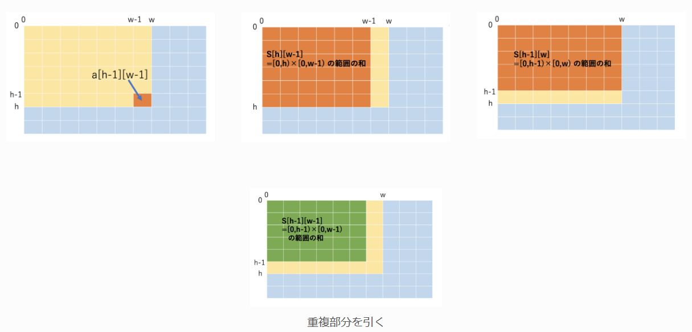

# A01. 整数の2乗

## 概要：
- 入力された整数Nの2乗（面積）を計算する

## ポイント：
- input()で整数を受け取る
- 算術演算

# A02. リスト内の値の判定

## 概要：
- 入力されたリストAにXが含まれているか判定する

## ポイント：
- map(int, input().split()) で複数の整数入力
- in演算子でリスト内の存在判定

# A03. 全探索によるペアの和の判定

## 概要：
- 2つのリストP, Qから1つずつ選び、その和がKになるペアが存在するか判定する

## ポイント：
- 2重for文による全探索

# A04. 2進数変換

## 概要：
- 入力された整数Nを2進数に変換し、10桁で0埋めして出力する

## ポイント：
- format(N, "010b") で2進数表現＋0埋め

# A05. 全探索効率化（3つの整数の和の組み合わせ）

## 概要：
- 赤・青・白の3つに1からNまでの数字を書き，その合計がKになる組み合わせの数を数える

## ポイント：
- 2重ループ+計算による3重ループ回避

# A06. 累積和による区間和の計算

## 概要：
- 配列Aの区間[L, R]の合計を複数回高速に求める

## ポイント：
- 累積和リストの構築

# A07. いもす法による区間和の計算

## 概要：
- イベントの各日における出席人数を求める

## ポイント：
- いもす法の利用
- いもす法：一部分に対して同一の変更を複数回行う場合に便利．指定された範囲の最初だけを事前に加算し最後の一つ外側を同じだけ減算し、最後にまとめて答えを計算する

# A08. 2次元累積和による区間和の計算

## 概要：
- H×Wの表で、任意の長方形領域の合計を高速に求める

## ポイント：
- 2次元累積和テーブルSを構築し、区間和を計算
- S[C][D] - S[A-1][D] - S[C][B-1] + S[A-1][B-1] で長方形領域の和を求める

# A09. 2次元いもす法

## 概要：
- H×Wの表で、最終的な各マスの積雪量を求める

## ポイント：
- 2次元いもす法で範囲加算を効率化
- 横方向・縦方向の累積和で最終値を計算
- print(*S[i][1:W+1]) で各行を空白区切りで出力

# A10. 区間除外最大値

## 概要：
- N個の部屋のうち、指定された区間[L, R]を除いたときに使える最大の部屋人数を求める

## ポイント：
- 左端からの最大値・右端からの最大値を前計算しておく

# A11. 二分探索による配列内の位置特定

## 概要：
- 小さい順に並んだ配列Aの中で、値Xが何番目にあるかを二分探索で求める

## ポイント：
- 二分探索法でXの位置を高速に探し、1-indexedで出力

# A12. 条件付き二分探索による最小時刻の決定

## 概要：
- N台のプリンターがあり、i台目は A[i] 秒ごとに1枚印刷する
- すべて同時に動かしたとき、合計がK枚以上になる最初の時刻を求める

## ポイント：
- 「t秒後に何枚印刷されるか」を count(t) = Σ⌊t / A[i]⌋ で計算する
- count(t) は t に対して単調非減少なので、条件 count(t) >= K を満たす最小の t を二分探索で求める
- 値そのものを探すのではなく、条件を満たす最小値を探す lower_bound 型（二分探索）を使う

# A13. しゃくとり法による差がK以下のペアの個数計算

## 概要：
- 異なる2つの整数ペアのうち、差がK以下となるペアの個数を求める

## ポイント：
- しゃくとり法：条件を満たすような区間をすべて求める
- 配列がソート済みなので、しゃくとり法（2ポインタ法）で高速にペア数を数える
- leftを固定し、rightを右に進めてA[right] - A[left] <= Kとなる最大のrightを探す

# A14. 部分和探索による4箱から合計Kの判定

## 概要：
- 4つの箱（A, B, C, D）からそれぞれ1枚ずつカードを選び、合計がKになる可能性があるか判定する

## ポイント：
- AとBの合計値をset（AB）で保持し、重複を自動で除去しつつ「値が存在するか」を平均O(1)で判定する
- CとDの合計値（CD）を順に見て、K - cd がABにあるかを調べることで4重ループを回避する
- for ... else を使うと、途中で見つかって break したときは Yes、最後まで見つからなかったときだけ else 側で No を出力できる

# A15. 座標圧縮による配列の圧縮

## 概要：
- 配列Aの大小関係を保ったまま、できるだけ小さい整数に圧縮した配列Bを求める

## ポイント：
- 配列Aの重複を除いて昇順ソートし、各値に1始まりの順位を割り当てる
- 辞書（rank）を使って元の値を圧縮後の値に変換

# A16. 動的計画法によるダンジョン最短移動時間の計算

## 概要：
- N個の部屋が一方通行で並ぶダンジョンで、部屋1から部屋Nまで移動する最短時間を求める
- 各部屋には「1つ先」または「2つ先」への通路があり、それぞれ移動時間が異なる

## ポイント：
- 動的計画法：大きな問題を小さな部分問題に分割して，その結果を記録，再利用する
- dp[i]を「部屋i+1に到達するまでの最短時間」として動的計画法で計算
- 部屋iには「1つ前からAで移動」または「2つ前からBで移動」の最短を選ぶ

# A17. 動的計画法によるダンジョン最短経路の復元

## 概要：
- N個の部屋が一方通行で並ぶダンジョンで、部屋1から部屋Nまで最短時間で移動する経路を1つ出力する
- 各部屋には「1つ先」または「2つ先」への通路があり、それぞれ移動時間が異なる

## ポイント：
- dp[i]を「部屋iに到達するまでの最短時間」として動的計画法で計算
- prev[i]で「部屋iに到達する直前の部屋」を記録し、経路復元を可能にする
- 部屋3以降は「1つ前からAで移動」または「2つ前からBで移動」の最短を選び、経路も記録
- 最後に部屋Nから部屋1までprevを辿って経路を復元し、逆順にして出力

# A18. 動的計画法による部分和判定（ナップサックDP）

## 概要：
- N枚のカードからいくつか選んで、合計がSになるかどうかを判定する

## ポイント：
- ナップザック問題：ナップザックの中にいくつかの品物を詰め込み，品物の総価値を最大にする
- ナップザック問題で，1回しか使えない場合は，forループは大きい方から回す
- dp[j]を「合計jが作れるかどうか」の真偽値として管理
- 各カードについて、合計Sからcard_valueまで逆順にdpを更新
- 最後にdp[S]がTrueなら「合計Sが作れる」→ Yes、FalseならNo

# A19. 動的計画法によるナップサック問題の最大価値計算

## 概要：
- N個のアイテムからいくつか選び、合計重量がW以下となるように選んだときの最大価値を求める（ナップサック問題）

## ポイント：
- dp[w]を「重さwで達成できる最大価値」として管理
- 各アイテムについて、重さWからw_iまで逆順にdpを更新（アイテムは1回ずつしか使えない）
- dp[w]を「使わない場合」と「使う場合（dp[w-w_i]+v_i）」で比較し、最大値を記録

# A20. 動的計画法による最長共通部分列（LCS）長の計算

## 概要：
- 2つの文字列S, Tが与えられたとき、両方に共通して現れる部分列のうち最長の長さ（LCS: Longest Common Subsequence）を求める

## ポイント：
- dp[i][j]を「Sのi文字目までとTのj文字目までの最長共通部分列の長さ」として管理
- 各文字について、S[i-1]とT[j-1]が一致すればdp[i-1][j-1]+1、そうでなければmax(dp[i-1][j], dp[i][j-1])
- 2重ループで全ての組み合わせを動的計画法で計算

# A21. 区間DPによる最大得点の計算（ブロック除去ゲーム）

## 概要：
- N個のブロックが並んでおり、各ブロックには「得点a_i」と「指定位置P_i」がある
- 区間[l, r]から端のブロックを1つずつ取り除いていく
- 取り除くブロックの指定位置P_iが現在の区間[l, r]の外にある場合のみ得点a_iを加える
- 全てのブロックを取り除く過程で得られる最大得点を求める

## ポイント：
- dp[l][r]を「区間[l, r]が残っているときに得られる最大得点」として区間DPで管理
- 区間の左端lまたは右端rを取り除く場合の得点をそれぞれ計算し、最大値を記録
- 区間の長さ1からNまで全ての区間についてDPを更新

# A22. 動的計画法によるすごろくの最大得点計算

## 概要：
- N個のすごろくでの最大得点を求める
- 各位置から「A[i]番目の位置」へ移動すると100点、「B[i]番目の位置」へ移動すると150点が加算される

## ポイント：
- dp[i]を「iに到達するまでの最大得点」として動的計画法で管理
- 初期値はdp[1]=0、他は-1（未到達）

# A23. ビット全探索によるクーポン組み合わせ最小化

## 概要：
- N種類の品物があり、M枚のクーポン券でそれぞれ無料で買える品物が決まっている
- すべての品物を無料で買うために必要な最小枚数のクーポン券を求める

## ポイント：
- 各クーポン券が無料で買える品物のセットをビット列（整数）で表現
- 1枚からM枚まで全てのクーポンの組み合わせをitertools.combinationsで全探索
- 組み合わせごとにビット演算（OR）でカバーできる品物を集計し、全品物をカバーできたら最小枚数を出力

# A24. 二分探索による最長増加部分列（LIS）長の計算

## 概要：
- 長さNの数列Aが与えられたとき、Aの最長増加部分列（LIS: Longest Increasing Subsequence）の長さを求める

## ポイント：
- LISの末尾の値を管理する配列dpを用意
- 各要素aについて、dp内でa以上の最小値の位置を二分探索（bisect_left）で探す
- 見つかった位置がdpの末尾ならaを追加、そうでなければその位置の値をaで置き換える

# A25. 動的計画法によるグリッド上の経路数計算

## 概要：
- H×Wのグリッドがあり、各マスは「白（.）」または「黒（#）」で構成される
- 左上(1,1)から右下(H,W)まで、黒いマスを避けて上下左右のみで移動する経路の総数を求める

## ポイント：
- dp[i][j]を「マス(1,1)からマス(i,j)への経路の総数」として管理
- 各マスについて、上・左から到達できる場合のみ経路数を加算

# A26. エラトステネスのふるいによる素数判定

## 概要：
- Q個の整数xについて、それぞれが素数かどうかを判定する

## ポイント：
- エラトステネスのふるいで最大値までの素数判定テーブルを事前に作成

# A27. ユークリッドの互除法による最大公約数（GCD）計算

## 概要：
- 2つの整数A, Bが与えられたとき、その最大公約数（GCD: Greatest Common Divisor）を求める

## ポイント：
- math.gcd(A, B)で最大公約数を高速に計算
- 標準ライブラリmathを使うことで実装が簡単

# A28. 剰余付き数値計算

## 概要：
- N回の演算指示（+, -, *）と数値Aが与えられ、現在の値に対して演算を順に適用する
- 各演算後、値を10000で割った余り（MOD 10000）を出力する

## ポイント：
- current_numberで現在の値を管理し、各演算指示に従って値を更新

# A29. 二分累乗法による高速べき乗計算（mod付き）

## 概要：
- 整数a, bが与えられたとき、aのb乗（a^b）を1000000007で割った余りを高速に計算する

## ポイント：
- 二分累乗法（繰り返し二乗法）でべき乗計算をO(log b)で高速化
- bの最下位ビットが1ならansにaを掛ける
- aを自乗し、bを半分にしながら繰り返す

# A30. フェルマーの小定理によるMOD計算

## 概要：
- n個からr個を選ぶ組み合わせ数（nCr）を1000000007で割った余りとして計算する

## ポイント：
- 割り算はMODではできないため、pow(x, MOD-2, MOD)で逆元を使って割り算を実現
- 計算量を抑えるため、階乗と逆元を事前計算

# A31. 包除原理による倍数の個数計算

## 概要：
- 1からNまでの整数のうち、3または5で割り切れる数の個数を求める

## ポイント：
- 3で割り切れる数、5で割り切れる数をそれぞれカウント
- 3と5両方で割り切れる数（15の倍数）は重複してカウントされるため、包除原理で調整
